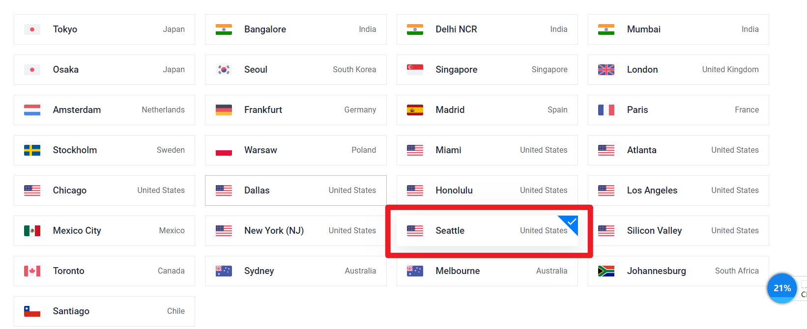

# 开通chatgpt-plus最新教程【可解决拒绝信用卡问题】

准备好科学上网的环境

大概流程跟大部分教程一样：

- 欧易（USDT）
- Depay
- Vultr

大部分人使用Depay卡在被拒绝使用信用卡这里,所以本教程多了Vultr,其目的是租用美国的服务器,远程进行操作,点击这里[Vultr](https://www.vultr.com/?ref=9028686-8H)进去注册的新用户有100美金的限时使用

只是想解决被拒绝使用信用卡的请看本教程后面

# 注册欧易

不需要开代理

[点击注册](https://www.cnouyi.care/cn/join/76029553)欧易,如果你是安卓的注册好之后下载app安装即可,如果你是iPhone的需要使用国外的AppleID才能在应用商店下载

```
App首页 -> 我要买币 -> 快捷买币 -> 选USDT -> 购买25USDT
```

如果你没有找到我要买币的位置地方,需要先切换到专业版（点击左上角的按钮,在你的账号下面有个切换至专业版的按钮,再回到首页就可以了）

使用Depay开卡有两种选择,花钱的和不花钱的,区别就是不花钱的需要上传身份证信息,如果你不想上传身份证信息的话可以在购买USDT的时候多准备10USDT

支持微信、支付宝........

```
新注册的欧易用户完成身份认证后，要等24小时才能提现
```

到这一步就已经兑换好了USDT,接下来就是需要将USDT提现到Depay

# 注册Depay账号

需要开代理操作

[点击注册](https://depay.depay.one/web-app/register-h5?invitCode=121606&lang=zh-cn)Depay,推荐使用谷歌邮箱,账号注册成功后,会让你下载它们的App安装

申请卡：

在首页点击“申请卡”,接下来就看个人选择是要花钱还是不花钱了,不花钱就选择上传身份证吧

# 欧易提现到Depay

打开Depay：

```
打开Depay -> 钱包 -> USDT -> 充币 -> 选择TRC20 -> 复制充值地址
```

接下来打开欧易：

```
首页 -＞　资产 -＞ 提币 -> USDT -> 链上提币
```

提币地址填你刚刚在Depay复制的地址, 提币网络也选择TRC20,别搞错了,不然钱就飞了

到这一步之后就已经完成了将欧易提现到Depay账户里了,但还没有提到你申请的卡片当中,接下来就需要操作下将Depay钱包的余额提现到你申请的卡片当中：

```
打开Depay -> 钱包 -> USDT -> 兑换
```

将USDT都兑换成USD

接着回到app的首页,在你申请的卡下面有个充值按钮,点它在里面充值USD就好了

# 注册vultr

[点击注册](https://www.vultr.com/?ref=9028686-8H)vultr,从该连接注册的新用户有100美金的限时使用（限时活动,只有从该链接注册才有送）

赠送的100美金是限时的, 懂技术的可以在有效的时间段内用服务器搭建个人的网站或者是后端服务来玩玩~

新用户想领取100美金的话需要先充5美金进账号,这个对一部分人只是暂时使用服务器来说不划算,所以我可以有偿提供服务器,详情进群了解

<div style="color: red;font-weight: 700;">找我提供服务（文章末尾进群）, 可直接跳过注册vultr</div>


注册好了之后接下来就需要充值至少5美元才会送100美元（支付宝没法最低充值5美元）：


充值后就是租服务器啦：





大概等个10多分钟就好了,然后你就可以远程登录访问了,


windows系统使用win+R快捷键在弹出的运行框中输入mstsc


点击连接之后会弹出一个框要输入账户跟密码,按照vultr给的账号密码输入即可

接下来只需要在这个远程服务器上登录chatgpt,按照正常流程开通就行了,

关于银行卡号,打开Depay后在你申请卡下方有个CVV安全码,点它然后接收验证码填上后会弹出一个框,把相应信息填入就好了

关于账单地址使用meiguodizhi.com,第一行地址填街道,第二行留空,把城市和邮编填上后会自动帮你把州给补全

# 注意

vultr操作完之后记得将服务器删掉,不然会持续扣费,就算余额为0了也能欠费

使用服务器操作后如果还是显示被拒绝, 可以新注册一个账号, 原来的服务器不要删掉, 再新部署一个服务器, 用新部署的服务器给新注册的账号开通plus【来找我的有两人开通一直被拒绝, 我按照这个去操作后就成功了】

另外不一定非得是美国的服务器, 只要是欧美的都可, 账单地址要跟地区对应上

有问题可以加入群聊

## 我们的团队

我们专注于提供问题解答服务、丰富的Java编程资源以及最新的ChatGPT资源，为您的Java编程学习和实践提供全方位支持。

您可以随时向我们的提问，无论是Java基础知识还是高级技巧，我们都将为您提供及时、专业的解答。此外，我们整合了优质Java编程相关资源，包括电子书、实例代码、博客文章等，帮助您深入了解Java编程技术。当然除了以上这些还会教你如何找到自己所需的内容, 比如你是不是经常遇到一段代码不知道如何使用, 遇到某个功能不知道有哪些工具可以帮你实现。

作为技术的先锋，我们还为您提供最新的ChatGPT资源，助您利用人工智能技术解决Java编程难题。加入我们的会员，您将享受更多优质资源和更快速的问题解答服务。

详情请加入扣扣群：647396272

VX群：